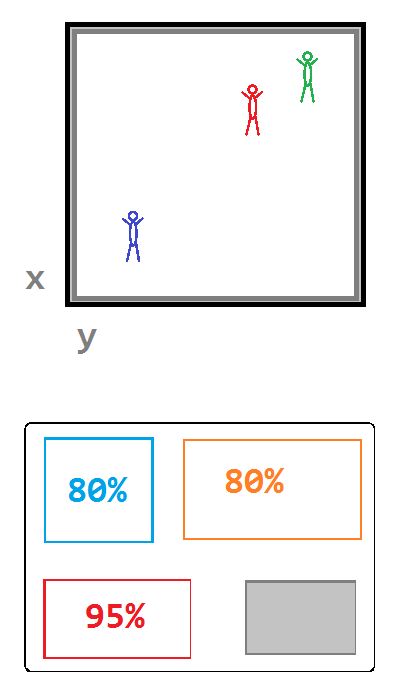

# Object Containers

## Overview

Our multi-step journey to Dynamic Server Meshing begins with the creation of Object Containers.

**Challenges:**
* traditional game levels consist of a list of objects (static and dynamic) which are loaded all on level start behind a loading screen
* to eventually be able to create a seamless universe with no loading screens and thousand of players, we can't load all objects into our memory all at once since the large amount of data would exceed our memory capacity

**Solution:** Object Containers

**Goals:**
* instead of designing a level, introduce the idea of level building blocks called Object Containers which make up individual parts of the level from which the entire level is made out of
* this will later allow parts of the level to be loaded and unloaded into/from the level at anytime while playing
* this requires the functionality to stream objects in and out of memory, even after the initial process of loading the level finished
* the current system does not allow for such functionality, so we need to implement a unified system which will allow objects to be loaded at any time
* it will then be used to build upon toward the final Server Meshing implementation where different parts of the level is going to be computed by different game servers.

**Approach:**
* put all unique objects referencing their resources (like geometry, assets and entity type) into their own Object Containers
* allow Object Containers to reference and have other Object Containers as children so that the final level emerges out of many nested Object Containers
* rework the existing levels to use the Object Containers and create all future content with Object Containers which requires changes to the engine editor
* on level start, load the level via the Object Containers. There does not exist any logic yet that loads Object Containers while playing and will be the functionality later introduced by Object Container Streaming which loads/unloads objects at any time
* Object Containers themselves were first introduced in Alpha 2.6.1 (Feb 2017) but many of the other features (Megamap, 64bit coordinates, Entity Components, etc.) made its debut with Alpha 3.0 (December 2017)

## Example

In the visual example on the left, we have loaded three players into the level. The red and green players are near each other on the same planet while the blue player is on a different planet far away. However, to avoid visual clutter, the planets, ships and other objects were left out of the image and we only show the connected players. We are going to revisit this example in the upcoming major technologies again.

Underneath, we also see a visual representation of the load on the individual computer components. The load on the CPU (blue) and GPU (red), how much RAM (orange) is in use, which part of the drive we loaded into memory (grey area). In this case the data of all objects were loaded from drive into memory, the load of CPU and GPU and memory occupied is quite high. (In the context of Server Meshing, the GPU is not as relevant as the CPU and memory.)

With the level split into different building blocks (Object Containers), the game could load and unload parts of the level at anytime. Therefore, we would only ever need to load the parts of the level into memory which are near and visible to the player (like a few kilometer sphere around the player) instead of having to load the entire level from drive into memory. This allows the game to keep memory consumption low enough to not exceed the maximum memory capacity. 

However, the functionality to stream objects from the drive into memory after the initial level load wasn't actually introduced yet with the release of the Object Containers. The player client and game server still had to load all objects of the level at its initial load because there was no logic yet that would tell client and server which objects it should load or unload. The functionality for streaming objects in and out of a level at any time became only possible with the introduction of Object Container Streaming which we will talk more about later.

